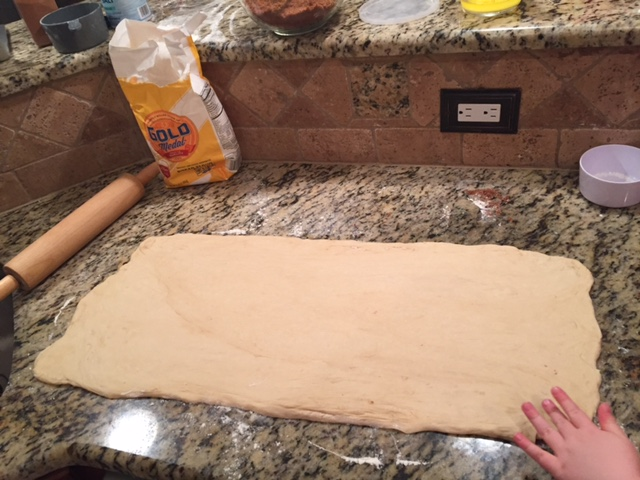
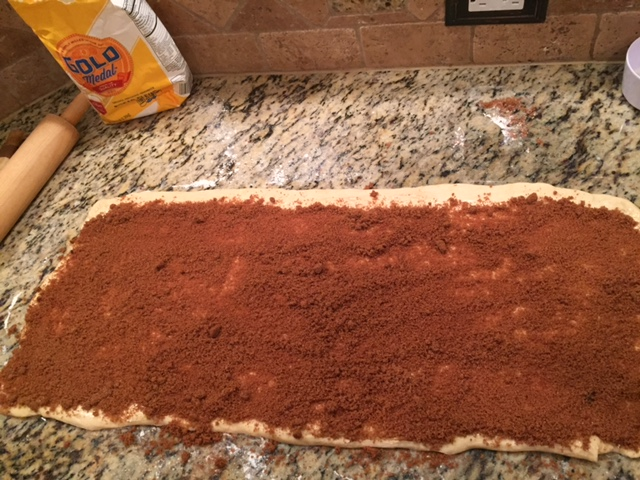
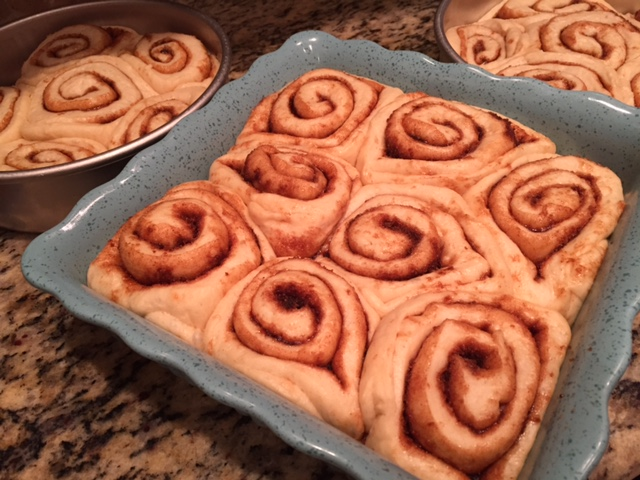
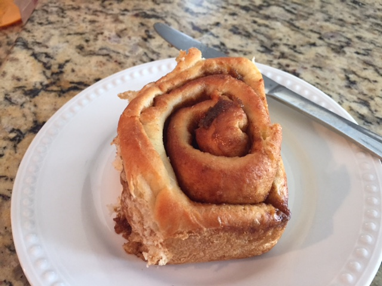
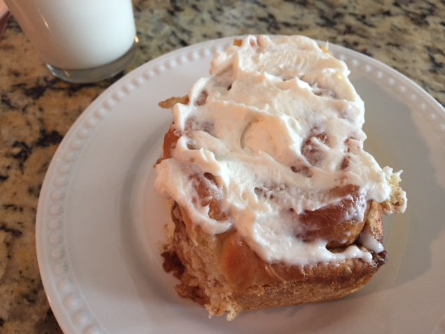
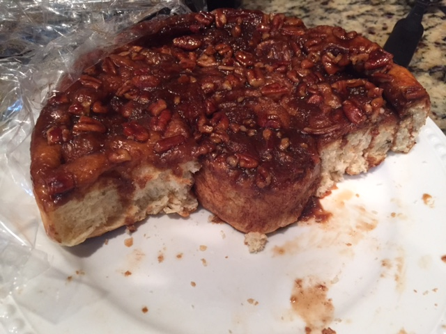

#Extra Special Cinnamon Rolls
-Eric du Toit

##Hints/tips

* Dissolve the yeast in water between 105° and 115°F - use a kitchen thermometer if you can.  
* When adding water for the second time, it should be near 100°F.  Yest is funny stuff.
* All ingredients should be room temp or warmer.  
* Put eggs in a bowl of warm-hot tap water to bring to room temp.
* Keep the dough warm but not hot when you are working with it and letting it stand.  Yeast doesn't like to be cold.
* You can use all purpose, but I find that bread flour works better
* **This is a huge recipe.  You can 1/2 it (I usually do)** 

##Rolls
* 2 pkgs. dry yeast
* 1/2 cup warm water (115°F)
* 1 Tbls. sugar
* pinch of ginger

Dissolve and let stand a bit (15 min)

**Add:**

* 2 cups warm water
* 1/2 cup sugar
* 2 tsp. salt
* 3 eggs, beaten
* 3 cups flour

Beat and let stand until light and full of bubbles

**Add:**

* 1/2 cup shortening
*  5 cups flour, more or less, to make soft dough

*Tip: don't over-flour.  The dough should be soft but not flaking apart*

Let rise until double in bulk (usually an hour, sometimes more), then roll out to about 22 inches across.  

You will probably need to stretch it out and shape it into a rectangle.  Before rolling up the dough, spread with butter.  Mix together 1/2lb dark brown sugar and 4 tsp cinnamon, and sprinkle on top. Leave a small strip buttered but no cinnamon mix - this will seal up the roll. 

Cut rolls into 1 1/4" segments and put into greased pans.  Let rise in a warm spot until light & double in size (usually an hour).  

Bake in a 375°-400° oven for 20 minutes or until done.

A full recipe done correctly can fill a 9x13 **and** 2 - 9" pans.

##Caramel-Pecan topping

Prepare rolls as above except do not grease pan.  Before rolling out the dough, in a small saucepan combine 2/3 cup packed brown sugar, 1/4 cup butter, and 2 tbsp light corn syrup.  Heat and stir over medium heat till combined.  Divide between the two 9" round pans.  Sprinkle 1/3 cup chopped pecans in each pan and set aside until rolls are cut.  After pulling rolls from oven, immediately invert the pan(s) and do not drizzle with icing.

##Icing
Any butter cream icing makes a great topping.

* 1/3 cup butter
* 4 1/2 cups powdered sugar
* 1/4 cup milk
* 1 1/2 teaspoons vanilla

Beat butter till fluff.  Gradually add 2 cups of the powedered sugar, beating well.  Slowly beat in the 1/4 cup milk and vanilla. 

Slowly beat in remaining powdered sugar.  Beat in additional milk if needed to reach spreadding consistency.

